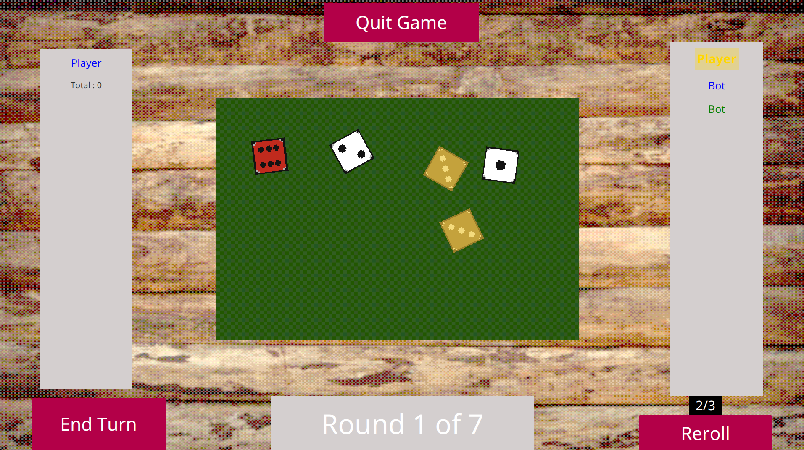

# Farky (Yams & Farkle Fusion) 🎲

**Farky** is a unique desktop strategy game developed in Java (JavaFX). It reimagines the classic **Yams (Yahtzee)** by infusing it with mechanics from **Farkle**, wrapped in a charming pixel-art interface.

> **Status:** Completed (University Project BUT1)
> **Team:** 2 Developers



## 📖 Overview

The main objective of Farky was to move beyond a simple console-based dice game. We aimed to create an engaging graphical experience that teaches OOP concepts and UI design. Inspired by dice mini-games in titles like *Kingdom Come: Deliverance*, we implemented a "Special Dice" system that adds strategic depth and RNG manipulation to the classic rules.

The project is built strictly following the **MVC (Model-View-Controller)** architectural pattern.

### ✨ Key Features

* **Hybrid Gameplay:** Classic Yams rules enhanced with Farkle risk/reward mechanics.
* **Special Dice System:**
    *  *Standard Dice*
    *  *St. Uriel (Holy) Dice:* Low risk, consistency focused.
    *  *Demonic Dice:* High risk, high reward.
* **Dynamic Opponents:** Play Solo, PvP (Local), or Watch Mode (Bot vs. Bot).
* **Customization:** Dynamic player addition, custom names, and color selection.
* **Pixel Art UI:** Retro aesthetic with animated rolls and intuitive "hold" mechanics.

---

## 🏗 Technical Architecture

The application leverages **JavaFX** for the frontend and separates concerns using **MVC**.

### Core Modules

| Module | Description |
| :--- | :--- |
| **Model** | Game state, dice logic (`DiceFactory`), player data, and combination rules (`FullHouse`, `Yahtzee`). |
| **View** | Visual representation using FXML layouts, CSS styling, and View classes (`DiceView`). |
| **Controller** | Handles user input, scene switching, and game flow (`BoardController`, `NavAgent`). |

### Project Structure
```text
src/main/java/yams/
├── controleur/       # Interaction logic (Board, Menu, Navigation)
├── model/
│   ├── combinations/ # Scoring logic (Chance, Poker, etc.)
│   ├── game/         # Core mechanics (DiceFactory, GameAgent)
│   └── players/      # Entities (Bot, Human, Scoresheet)
└── vue/              # UI Components (FXML, CSS, View Classes)
```


## 🚀 How to Run

You don't need an IDE to play the game.\
You only need **Java** installed on your system.


### 1. Prerequisites

Make sure you have **Java Runtime Environment (JRE)** or **JDK 17+**
installed.

Check your Java version:

``` bash
java -version
```


### 2. Launching the Game

Download the `Yams.jar` file and follow the
instructions for your operating system.


### 🪟 Windows

**Option 1 --- Click & Play**

-   Double-click the `.jar` file.

**Option 2 --- Command Line (recommended)**

1.  Open the folder containing the `.jar` file.
2.  Right-click → **Open in Terminal / PowerShell**
3.  Run:

``` powershell
java -jar Yams.jar
```

### 🐧 Linux

1.  Open a terminal in the folder containing the `.jar` file.
2.  (Optional) Make the file executable:

``` bash
chmod +x Yams.jar
```

3.  Run the game:

``` bash
java -jar Yams.jar
```


## 🔮 Future Roadmap

[ ] Progression System: Unlock better/rare dice types by winning matches.

[ ] Advanced AI: Implement smarter decision-making algorithms for Bots.

[ ] Network Play: Add support for online multiplayer.

👥 Authors

* Kefa Yevhen

* Nachnouchi Adam

> **Developed as part of the "Graphical Interface Development" course at IUT.**